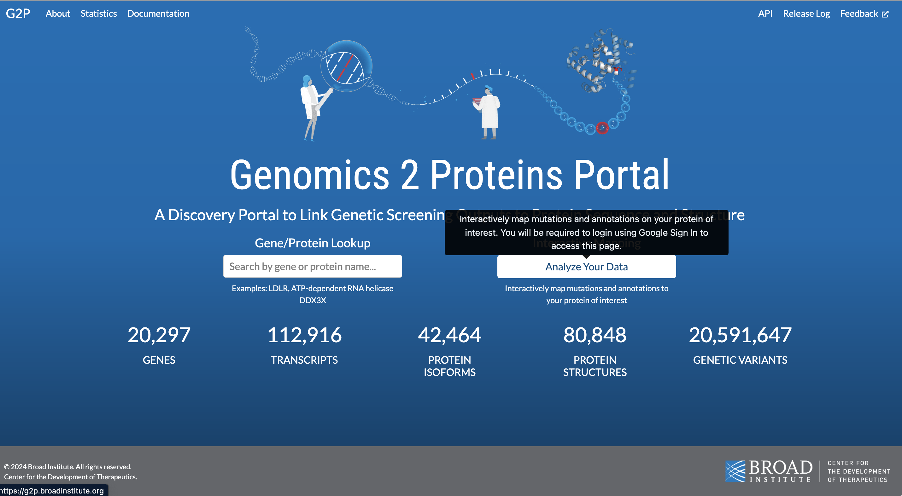
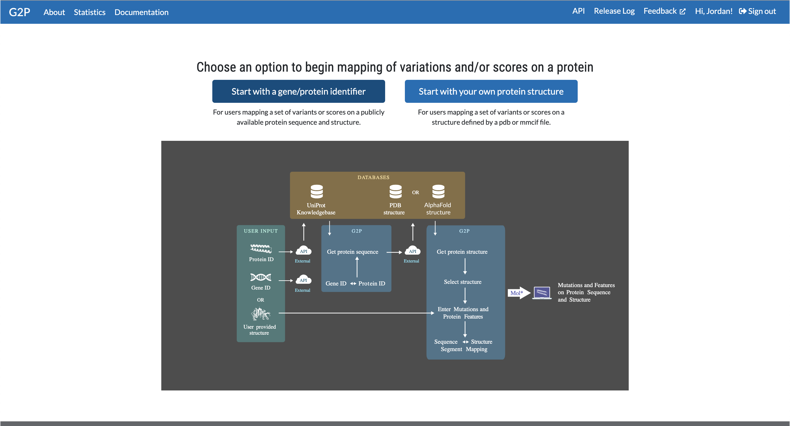
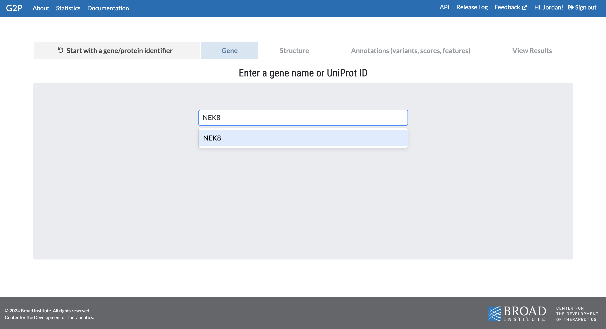
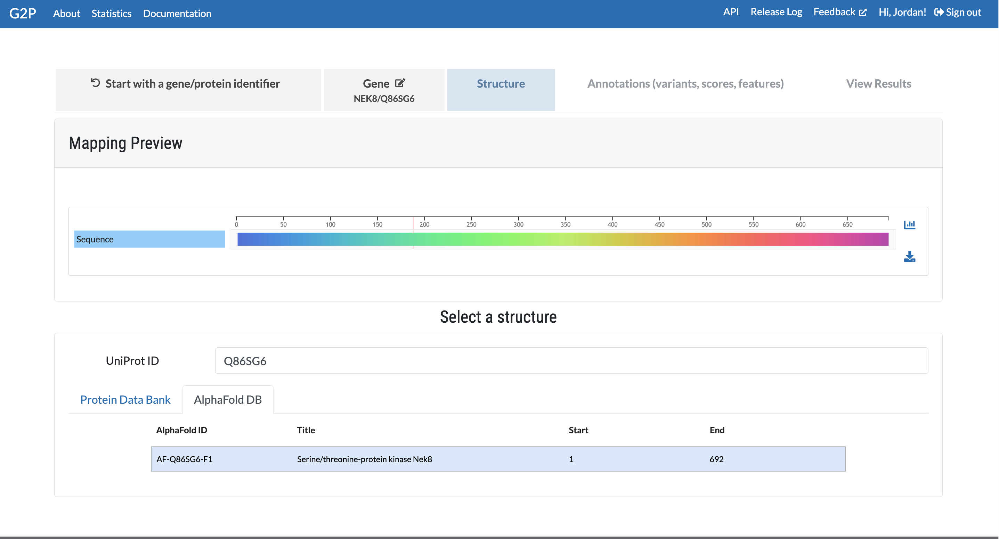
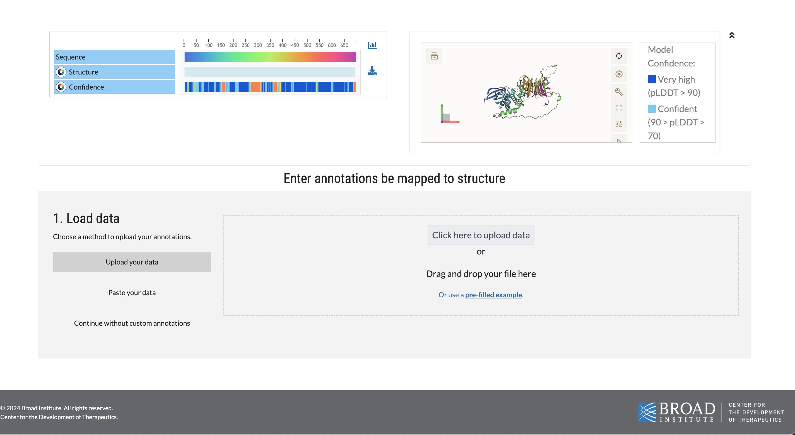
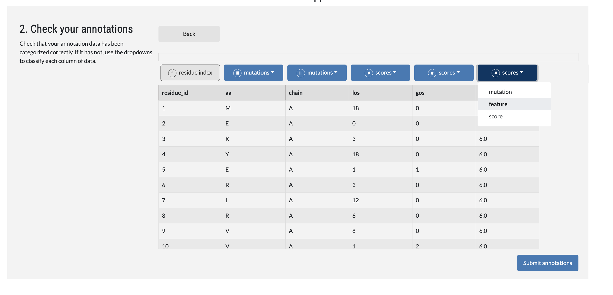
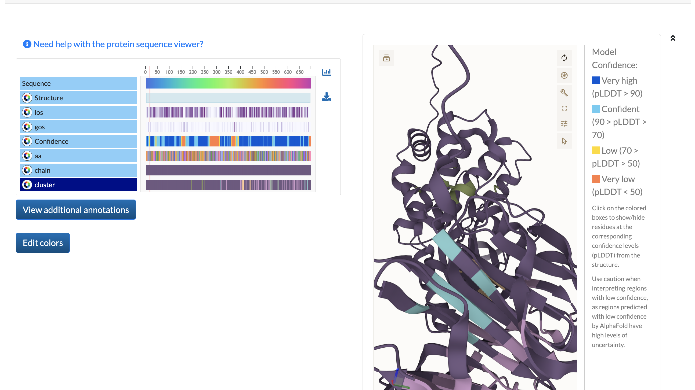

# ProtSCP - Protein Stability Clustering Pipeline
The clustering pipeline allows any user to identify gain-of-stability and loss-of-stability clusters of interest from an in-silico saturation mutagenisis screening.  

First, the raw ∆∆G outputs are computed through the mutategenisis screening, and then all required data is merged for further processing. 

Next, gain-of-stability and loss-of-stability sites are identified for clustering. In order to accomplish this in an unbiased manner, the screening outputs are separated into positive (loss-of-stability) and negative (gain-of-stability) subsets, and a gamma distribution is fit to each subset. Gain-of-stability and loss-of-stabililty sites are identified, where the ∆∆G value associated with a mutationn falls into the top 5% of the distribution. 

Finally, the pipeline computes clusters by clustering on the gain-of-stability and loss-of-stability sites. Clustering is completed with agglomerative clustering on the prioritized sites in the structure. Sites are clustered if prioritized hits are within 6 Angstroms (measured by C-alpha distance) in the 3D structure.

## Outline
1. <i>In Silico</i> Saturation Mutagenesis: Run FoldX -> Raw FoldX data & Structure Coordinates -> Merged Data
2. Hit and Site Prioritization: Merged Data -> Prioritized Sites
3. 3-Dimensional Clustering: Prioritized Sites -> 3-Dimensional Clusters

## Usage

### Stage 1: <i>In Silico</i> Saturation Mutagenesis
#### Stage 1.1: Getting FoldX data
1. Install the [FoldX](https://foldxsuite.crg.eu/) binary (currently for FoldX5) and the PDB or PDBs.
2. Install [MutateX](https://www.github.com/elelab/mutatex)
3. Use MutateX with FoldX's BuildModel command (Repair step recommended) to compute FoldX values.
See the recommended configuration used in the study, [attached](foldx_cfg/).


#### Stage 1.2: Parsing raw FoldX data and Protein Structure data
In [find_clusters.ipynb](find_clusters.ipynb), results can be extracted from a path directly to a pandas dataframe for downstream analysis. See 2a, 2b, and 2c for details and commandline usage.

##### 1.2a: FoldX
###### Single Gene/Structure
```sh
python3 ddg_clustering/preprocess_mutatex single my/mutatex/results/single_structure_path  my_output_file.csv
```
###### Parsing directory with multiple results
```sh
python3 ddg_clustering/preprocess_mutatex all my/mutatex/results/path  output_dir
```

##### 1.2b: Protein Structure
```sh
python3 ddg_clustering/preprocess_structure <uniprot_id> output_structure.csv
```


##### 1.2c: Joining FoldX and Structure Coordinate data to joint CSV for downstream processing
```sh
python3 ddg_clustering/merge_datasets.py my_mutatex_data.csv my_structure_data.csv output_dataset.csv
```

##### Streamlined joint data preperation step (automates Stage 2a,2b,2c)
```sh
python3 ddg_clustering/prepare_data.py my/mutatex/results/path <uniprot_id> output_dataset.csv
```
### Stage 2: Hit and Site Prioritization
In [find_clusters.ipynb](find_clusters.ipynb), hits are prioritized based on pvalue (adjustable by user).

### Stage 3: 3-Dimensional Clustering
In [find_clusters.ipynb](find_clusters.ipynb), clusters are generated through agglomerative clustering and output data is saved for visualization on protein sequence and structure.

### Visualizing Clusters
#### 1. Go to the [G2P portal](g2p.broadinstitute.org)

#### 2. Select "Interactive Mapping"


#### 3. Select "Start with a gene..." for an existing PDB or AlphaFold structure


#### 4. Search and select a gene (ie TAOK1)


#### 5. Select the AlphaFold structure


#### 6. Upload the cluster annotation CSV


#### 7. Fix the column types in the validations for aa, chain, and clusters.
Set aa, chain, and clusters columns to all have the "features" type for categorical features.




#### 8. Map the results!
Click on the cluster row label to map the cluster data from the protein sequence to the protein structure.




## Details (MutateX operation) (Config files in foldx_cfg dir)

mutation_list.txt
```
G
A
V
L
I
...
```

repair_runfile_template.txt
```
command=RepairPDB
pdb=$PDBS$
temperature=298
water=-CRYSTAL
complexWithDNA=true
```

mutate_runfile_template.txt
```
command=BuildModel
pdb=$PDBS$
mutant-file=individual_list.txt
water=-CRYSTAL
numberOfRuns=$NRUNS$
```

running mutatex
```
  mutatex $PDB_FILENAME \
        -p $NUM_CORES \
        -m mutation_list.txt \
        -x $FOLDX_PATH \
        -f suite5 \
        -u \
        -R repair_runfile_template.txt \
        -M mutate_runfile_template.txt  &>> out.log
```
